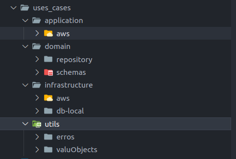
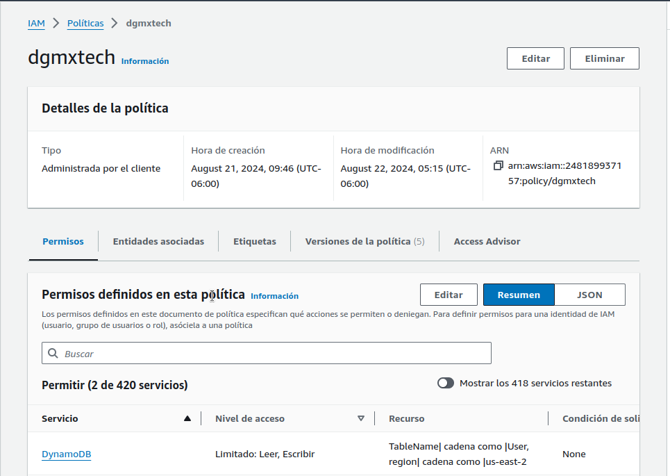
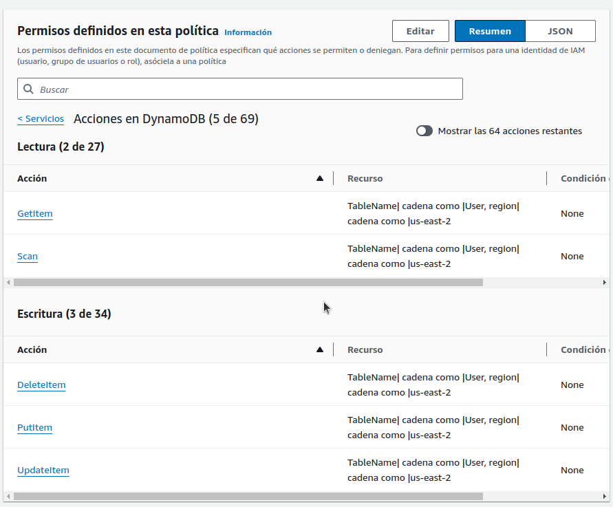

# The awesome ToDo list! 😎 (backend)

Hola 👋

- Este proyecto es parte de la prueba técnica para evaluar habilidades.
- Contiene buenas practicas de desarrollo como Clean Code
- Este proyecto trabaja con TypeScript
- Contiene integrado el [SDK de AWS](https://docs.aws.amazon.com/sdk-for-javascript/v3/developer-guide/getting-started-nodejs.html)


## Overview 👀

Tu como usuario podrás :
- Create tareas
- Listar tareas
- Completar tareas
- Eliminar tareas

[Grabación back](https://github.com/user-attachments/assets/9ac09388-8705-47ba-823c-a958bdd71cc9)


## How to run

1. Necesitas las credenciales. Buscar en correo electrónico. [.env](.env.template)
2. Copia las credenciales en el root del proyecto
4. Ejecuta ```npm i``` para descargar las dependencias
3. Ejecuta ```npm run dev``` para correr en local el proyecto

- NOTE ⚠️  Checa el archivo [package.json](package.json) para ver otras configuraciones

## Architecture

- Este es la arquitectura de las archivos



### ToDo
- Es la entidad que se manipula

### Domain


#### Schema

- Contiene las entidades del modelo del negocio
    - [ToDo](src/uses_cases/domain/schemas/ToDo.ts)
- Contiene las reglas de negocio
    - Para este caso ```title``` y ```description``` son necesarios para create un ToDo
- Contiene las validaciones para que esto se cumpla
    - [TodoDescriptionValueObject.ts](src/uses_cases/utils/valuObjects/TodoDescriptionValueObject.ts)
    - [TodoTitleValueObject.ts](src/uses_cases/utils/valuObjects/TodoTitleValueObject.ts)
    - [UUIDValueObject.ts](src/uses_cases/utils/valuObjects/UUID.ValueObject.ts)
    - [ValueObject.t](src/uses_cases/utils/valuObjects/ValueObject.ts)

#### Repository

- Contiene las firmas que el las operaciones con los modelos deben seguir
- Si quires un listado unicamente de ```Titulos``` de los todos, esta firma va aquí
- Contiene las firmas de las operaciones:
    - [CreateTodo.repository.ts](src/uses_cases/domain/repository/Todo/CreateTodo.repository.ts)
    - [DeleteByUUID.repository.ts](src/uses_cases/domain/repository/Todo/DeleteByUUID.repository.ts)
    - [GetToDoByUUID.repository.ts](src/uses_cases/domain/repository/Todo/GetToDoByUUID.repository.ts)
    - [ListToDos.repository.ts](src/uses_cases/domain/repository/Todo/ListToDos.repository.ts)
    - [ToggleByUUID.repository.ts](src/uses_cases/domain/repository/Todo/ToggleByUUID.repository.ts)


### Infrastructure
- Contiene la implementaciones de las firmas de las operaciones
- En este caso se uso ```aws-sdk``` para realizar las peticiones

### AWS (sdk)

- [Implementación del las firmas con el sdk](src/uses_cases/infrastructure/aws)
    - [aws/config](src/uses_cases/infrastructure/aws/config)
    - [aws/ToDo](src/uses_cases/infrastructure/aws/ToDo)
        - [CreateToDo.aws.ts](src/uses_cases/infrastructure/aws/ToDo/CreateToDo.aws.ts)
        - [DeleteByUUID.aws.ts](src/uses_cases/infrastructure/aws/ToDo/DeleteByUUID.aws.ts)
        - [GetToDoByUUID.aws.ts](src/uses_cases/infrastructure/aws/ToDo/GetToDoByUUID.aws.ts)
        - [ListToDos.aws.ts](src/uses_cases/infrastructure/aws/ToDo/ListToDos.aws.ts)
        - [ToggleByUUID.aws.t](src/uses_cases/infrastructure/aws/ToDo/ToggleByUUID.aws.ts)
    - [aws/utils](src/uses_cases/infrastructure/aws/utils)


### Application
- Se hacen uso de la *infraestructura*
- si quieres lanzar una request a AWS y a FireBase aquí se implantan estas operaciones ya definidas en la *infraestructura*


## AWS

- Par la prueba se creo un usuario asignándole permisos específicos de lectura y escritura Usando las ```Políticas```



- Se asignaron los permisos a los recursos específicos de DynamoDB


